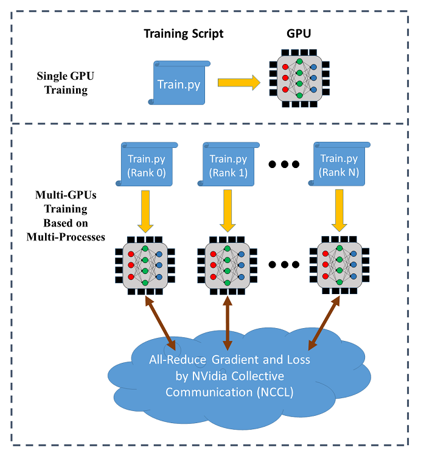

<!--- Licensed to the Apache Software Foundation (ASF) under one or more contributor license agreements.  See the NOTICE file distributed with this work for additional information regarding copyright ownership.  The ASF licenses this file to you under the Apache License, Version 2.0 (the "License"); you may not use this file except in compliance with the License.  You may obtain a copy of the License at http://www.apache.org/licenses/LICENSE-2.0 Unless required by applicable law or agreed to in writing, software distributed under the License is distributed on an "AS IS" BASIS, WITHOUT WARRANTIES OR CONDITIONS OF ANY KIND, either express or implied.  See the License for the specific language governing permissions and limitations under the License.  -->

SINGA supports data parallel training across multiple GPUs (on a single node or
across different nodes). The following figure illustrates the data parallel
training:



In distributed training, each process (called a worker) runs a training script
over a single GPU. Each process has an individual communication rank. The
training data is partitioned among the workers and the model is replicated on
every worker. In each iteration, the workers read a mini-batch of data (e.g.,
256 images) from its partition and run the BackPropagation algorithm to compute
the gradients of the weights, which are averaged via all-reduce (provided by
[NCCL](https://developer.nvidia.com/nccl)) for weight update following
stochastic gradient descent algorithms (SGD).

The all-reduce operation by NCCL can be used to reduce and synchronize the
gradients from different GPUs. Let's consider the training with 4 GPUs as shown
below. Once the gradients from the 4 GPUs are calculated, all-reduce will return
the sum of the gradients over the GPUs and make it available on every GPU. Then
the averaged gradients can be easily calculated.


## Usage

SINGA implements a module called `DistOpt` (a subclass of `Opt`) for distributed
training. It wraps a normal SGD optimizer and calls `Communicator` for gradients
synchronization. The following example illustrates the usage of `DistOpt` for
training a CNN model over the MNIST dataset. The source code is available
[here](https://github.com/apache/singa/blob/master/examples/cnn/), and there is
a [Colab notebook]() for it.

### Example Code

1. Define the neural network model:

```python
class CNN(model.Model):

    def __init__(self, num_classes=10, num_channels=1):
        super(CNN, self).__init__()
        self.conv1 = layer.Conv2d(num_channels, 20, 5, padding=0, activation="RELU")
        self.conv2 = layer.Conv2d(20, 50, 5, padding=0, activation="RELU")
        self.linear1 = layer.Linear(500)
        self.linear2 = layer.Linear(num_classes)
        self.pooling1 = layer.MaxPool2d(2, 2, padding=0)
        self.pooling2 = layer.MaxPool2d(2, 2, padding=0)
        self.relu = layer.ReLU()
        self.flatten = layer.Flatten()
        self.softmax_cross_entropy = layer.SoftMaxCrossEntropy()

    def forward(self, x):
        y = self.conv1(x)
        y = self.pooling1(y)
        y = self.conv2(y)
        y = self.pooling2(y)
        y = self.flatten(y)
        y = self.linear1(y)
        y = self.relu(y)
        y = self.linear2(y)
        return y

    def train_one_batch(self, x, y, dist_option='fp32', spars=0):
        out = self.forward(x)
        loss = self.softmax_cross_entropy(out, y)

        # Allow different options for distributed training
        # See the section "Optimizations for Distributed Training"
        if dist_option == 'fp32':
            self.optimizer(loss)
        elif dist_option == 'fp16':
            self.optimizer.backward_and_update_half(loss)
        elif dist_option == 'partialUpdate':
            self.optimizer.backward_and_partial_update(loss)
        elif dist_option == 'sparseTopK':
            self.optimizer.backward_and_sparse_update(loss,
                                                      topK=True,
                                                      spars=spars)
        elif dist_option == 'sparseThreshold':
            self.optimizer.backward_and_sparse_update(loss,
                                                      topK=False,
                                                      spars=spars)
        return out, loss

# create model
model = CNN()
```

2. Create the `DistOpt` instance and attach it to the created model:

```python
sgd = opt.SGD(lr=0.005, momentum=0.9, weight_decay=1e-5)
sgd = opt.DistOpt(sgd)
model.set_optimizer(sgd)
dev = device.create_cuda_gpu_on(sgd.local_rank)
```

Here are some explanations concerning some variables in the code:

(i) `dev`

dev represents the `Device` instance, where to load data and run the CNN model.

(ii)`local_rank`

Local rank represents the GPU number the current process is using in the same
node. For example, if you are using a node with 2 GPUs, `local_rank=0` means
that this process is using the first GPU, while `local_rank=1` means using the
second GPU. Using MPI or multiprocess, you are able to run the same training
script which is only different in the value of `local_rank`.

(iii)`global_rank`

Rank in global represents the global rank considered all the processes in all
the nodes you are using. Let's consider the case you have 3 nodes and each of
the node has two GPUs, `global_rank=0` means the process using the 1st GPU at
the 1st node, `global_rank=2` means the process using the 1st GPU of the 2nd
node, and `global_rank=4` means the process using the 1st GPU of the 3rd node.

3. Load and partition the training/validation data:

```python
def data_partition(dataset_x, dataset_y, global_rank, world_size):
    data_per_rank = dataset_x.shape[0] // world_size
    idx_start = global_rank * data_per_rank
    idx_end = (global_rank + 1) * data_per_rank
    return dataset_x[idx_start:idx_end], dataset_y[idx_start:idx_end]

train_x, train_y, test_x, test_y = load_dataset()
train_x, train_y = data_partition(train_x, train_y,
                                  sgd.global_rank, sgd.world_size)
test_x, test_y = data_partition(test_x, test_y,
                                sgd.global_rank, sgd.world_size)
```

A partition of the dataset is returned for this `dev`.

Here, `world_size` represents the total number of processes in all the nodes you
are using for distributed training.

4. Initialize and synchronize the model parameters among all workers:

```python
#Synchronize the initial parameter
tx = tensor.Tensor((batch_size, 1, IMG_SIZE, IMG_SIZE), dev, tensor.float32)
ty = tensor.Tensor((batch_size, num_classes), dev, tensor.int32)
model.compile([tx], is_train=True, use_graph=graph, sequential=True)
...
#Use the same random seed for different ranks
seed = 0
dev.SetRandSeed(seed)
np.random.seed(seed)
```

5. Run BackPropagation and distributed SGD

```python
for epoch in range(max_epoch):
    for b in range(num_train_batch):
        x = train_x[idx[b * batch_size: (b + 1) * batch_size]]
        y = train_y[idx[b * batch_size: (b + 1) * batch_size]]
        tx.copy_from_numpy(x)
        ty.copy_from_numpy(y)
        # Train the model
        out, loss = model(tx, ty)
```

### Execution Instruction

There are two ways to launch the training: MPI or Python multiprocessing.

#### Python multiprocessing

It works on a single node with multiple GPUs, where each GPU is one worker.

1. Put all the above training codes in a function

```python
def train_mnist_cnn(nccl_id=None, local_rank=None, world_size=None):
    ...
```

2. Create `mnist_multiprocess.py`

```python
if __name__ == '__main__':
    # Generate a NCCL ID to be used for collective communication
    nccl_id = singa.NcclIdHolder()

    # Define the number of GPUs to be used in the training process
    world_size = int(sys.argv[1])

    # Define and launch the multi-processing
	import multiprocessing
    process = []
    for local_rank in range(0, world_size):
        process.append(multiprocessing.Process(target=train_mnist_cnn,
                       args=(nccl_id, local_rank, world_size)))

    for p in process:
        p.start()
```

Here are some explanations concerning the variables created above:

(i) `nccl_id`

Note that we need to generate a NCCL ID here to be used for collective
communication, and then pass it to all the processes. The NCCL ID is like a
ticket, where only the processes with this ID can join the all-reduce operation.
(Later if we use MPI, the passing of NCCL ID is not necessary, because the ID is
broadcased by MPI in our code automatically)

(ii) `world_size`

world_size is the number of GPUs you would like to use for training.

(iii) `local_rank`

local_rank determine the local rank of the distributed training and which gpu is
used in the process. In the code above, we used a for loop to run the train
function where the argument local_rank iterates from 0 to world_size. In this
case, different processes can use different GPUs for training.

The arguments for creating the `DistOpt` instance should be updated as follows

```python
sgd = opt.DistOpt(sgd, nccl_id=nccl_id, local_rank=local_rank, world_size=world_size)
```

3. Run `mnist_multiprocess.py`

```sh
python mnist_multiprocess.py 2
```

It results in speed up compared to the single GPU training.

```
Starting Epoch 0:
Training loss = 408.909790, training accuracy = 0.880475
Evaluation accuracy = 0.956430
Starting Epoch 1:
Training loss = 102.396790, training accuracy = 0.967415
Evaluation accuracy = 0.977564
Starting Epoch 2:
Training loss = 69.217010, training accuracy = 0.977915
Evaluation accuracy = 0.981370
Starting Epoch 3:
Training loss = 54.248390, training accuracy = 0.982823
Evaluation accuracy = 0.984075
Starting Epoch 4:
Training loss = 45.213406, training accuracy = 0.985560
Evaluation accuracy = 0.985276
Starting Epoch 5:
Training loss = 38.868435, training accuracy = 0.987764
Evaluation accuracy = 0.986278
Starting Epoch 6:
Training loss = 34.078186, training accuracy = 0.989149
Evaluation accuracy = 0.987881
Starting Epoch 7:
Training loss = 30.138697, training accuracy = 0.990451
Evaluation accuracy = 0.988181
Starting Epoch 8:
Training loss = 26.854443, training accuracy = 0.991520
Evaluation accuracy = 0.988682
Starting Epoch 9:
Training loss = 24.039650, training accuracy = 0.992405
Evaluation accuracy = 0.989083
```

#### MPI

It works for both single node and multiple nodes as long as there are multiple
GPUs.

1. Create `mnist_dist.py`

```python
if __name__ == '__main__':
    train_mnist_cnn()
```

2. Generate a hostfile for MPI, e.g. the hostfile below uses 2 processes (i.e.,
   2 GPUs) on a single node

```txt
localhost:2
```

3. Launch the training via `mpiexec`

```sh
mpiexec --hostfile host_file python mnist_dist.py
```

It could result in speed up compared to the single GPU training.

```
Starting Epoch 0:
Training loss = 383.969543, training accuracy = 0.886402
Evaluation accuracy = 0.954327
Starting Epoch 1:
Training loss = 97.531479, training accuracy = 0.969451
Evaluation accuracy = 0.977163
Starting Epoch 2:
Training loss = 67.166870, training accuracy = 0.978516
Evaluation accuracy = 0.980769
Starting Epoch 3:
Training loss = 53.369656, training accuracy = 0.983040
Evaluation accuracy = 0.983974
Starting Epoch 4:
Training loss = 45.100403, training accuracy = 0.985777
Evaluation accuracy = 0.986078
Starting Epoch 5:
Training loss = 39.330826, training accuracy = 0.987447
Evaluation accuracy = 0.987179
Starting Epoch 6:
Training loss = 34.655270, training accuracy = 0.988799
Evaluation accuracy = 0.987780
Starting Epoch 7:
Training loss = 30.749735, training accuracy = 0.989984
Evaluation accuracy = 0.988281
Starting Epoch 8:
Training loss = 27.422146, training accuracy = 0.991319
Evaluation accuracy = 0.988582
Starting Epoch 9:
Training loss = 24.548153, training accuracy = 0.992171
Evaluation accuracy = 0.988682
```

## Optimizations for Distributed Training

SINGA provides multiple optimization strategies for distributed training to
reduce the communication cost. Refer to the API for `DistOpt` for the
configuration of each strategy.

When we use `model.Model` to build a model, we need to put the options for
distributed training in the `train_one_batch` method. Please refer to the
example code on top of this page. We could just copy the code for the options
and use it in other models.

With the defined options, we can put the arguments `dist_option` and `spars`
when we start the training with `model(tx, ty, dist_option, spars)`

### No Optimizations

```python
out, loss = model(tx, ty)
```

`loss` is the output tensor from the loss function, e.g., cross-entropy for
classification tasks.

### Half-precision Gradients

```python
out, loss = model(tx, ty, dist_option = 'fp16')
```

It converts each gradient value to 16-bit representation (i.e., half-precision)
before calling all-reduce.

### Partial Synchronization

```python
out, loss = model(tx, ty, dist_option = 'partialUpdate')
```

In each iteration, every rank do the local sgd update. Then, only a chunk of
parameters are averaged for synchronization, which saves the communication cost.
The chunk size is configured when creating the `DistOpt` instance.

### Gradient Sparsification

It applies sparsification schemes to select a subset of gradients for
all-reduce. There are two scheme:

- The top-K largest elements are selected. spars is the portion (0 - 1) of total
  elements selected.

```python
out, loss = model(tx, ty, dist_option = 'sparseTopK', spars = spars)
```

- All gradients whose absolute value are larger than predefined threshold spars
  are selected.

```python
out, loss = model(tx, ty, dist_option = 'sparseThreshold', spars = spars)
```

The hyper-parameters are configured when creating the `DistOpt` instance.

## Implementation

This section is mainly for developers who want to know how the code in
distribute module is implemented.

### C interface for NCCL communicator

Firstly, the communication layer is written in C language
[communicator.cc](https://github.com/apache/singa/blob/master/src/io/communicator.cc).
It applies the NCCL library for collective communication.

There are two constructors for the communicator, one for MPI and another for
multiprocess.

(i) Constructor using MPI

The constructor first obtains the global rank and the world size first, and
calculate the local rank. Then, rank 0 generates a NCCL ID and broadcast it to
every rank. After that, it calls the setup function to initialize the NCCL
communicator, cuda streams, and buffers.

(ii) Constructor using Python multiprocess

The constructor first obtains the rank, the world size, and the NCCL ID from the
input argument. After that, it calls the setup function to initialize the NCCL
communicator, cuda streams, and buffers.

After the initialization, it provides the all-reduce functionality to
synchronize the model parameters or gradients. For instance, synch takes a input
tensor and perform all-reduce through the NCCL routine. After we call synch, it
is necessary to call wait function to wait for the all-reduce operation to be
completed.

### Python interface for DistOpt

Then, the python interface provide a
[DistOpt](https://github.com/apache/singa/blob/master/python/singa/opt.py) class
to wrap an
[optimizer](https://github.com/apache/singa/blob/master/python/singa/opt.py)
object to perform distributed training based on MPI or multiprocessing. During
the initialization, it creates a NCCL communicator object (from the C interface
as mentioned in the subsection above). Then, this communicator object is used
for every all-reduce operations in DistOpt.

In MPI or multiprocess, each process has an individual rank, which gives
information of which GPU the individual process is using. The training data is
partitioned, so that each process can evaluate the sub-gradient based on the
partitioned training data. Once the sub-gradient is calculated on each
processes, the overall stochastic gradient is obtained by all-reducing the
sub-gradients evaluated by all processes.
