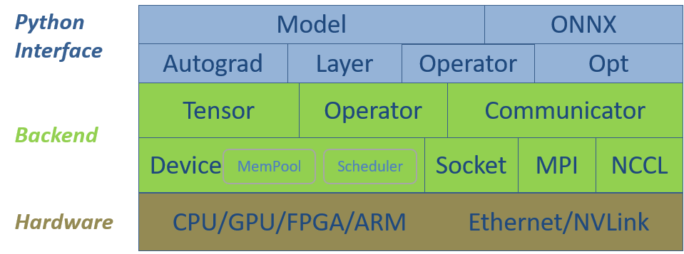

<!--- Licensed to the Apache Software Foundation (ASF) under one or more contributor license agreements.  See the NOTICE file distributed with this work for additional information regarding copyright ownership.  The ASF licenses this file to you under the Apache License, Version 2.0 (the "License"); you may not use this file except in compliance with the License.  You may obtain a copy of the License at http://www.apache.org/licenses/LICENSE-2.0 Unless required by applicable law or agreed to in writing, software distributed under the License is distributed on an "AS IS" BASIS, WITHOUT WARRANTIES OR CONDITIONS OF ANY KIND, either express or implied.  See the License for the specific language governing permissions and limitations under the License.  -->

SINGA的软件栈包括两个主要层次，底层后端和Python接口层。图1展示了它们与硬件的关系。后端组件为深度学习模型提供基本的数据结构，为调度和执行操作提供硬件抽象，为分布式训练提供通信组件。Python接口封装了部分CPP数据结构，并为神经网络训练提供了额外的高级类，方便实现复杂的神经网络模型。

接下来，我们以自下而上的方式介绍软件栈。

   **Figure 1 - SINGA V3
软件栈结构**

## 底层后端

### Device

每个`Device`实例，即一个设备，是针对一个硬件设备创建的，例如GPU或CPU。`Device`管理数据结构的内存，并调度操作的执行，例如，在CUDA流或CPU线程上。根据硬件及其编程语言，SINGA实现了以下特定的设备类。

- **CudaGPU** 代表Nvidia GPU卡,执行单元是CUDA流。
- **CppCPU** 代表一个普通的CPU,执行单位是CPU线程。
- **OpenclGPU** 代表Nvidia和AMD的普通GPU卡,执行单位是CommandQueue,鉴于OpenCL与许多硬件设备兼容，如FPGA和ARM，OpenclGPU可以扩展到其他设备。

### Tensor

`Tensor`类表示一个多维数组，它存储模型变量，例如，来自卷积层的输入图像和特征图。每个`Tensor`实例（即张量）都分配在一个设备上，它管理张量的内存，并针对张量调度（计算）操作。大多数机器学习算法可以使用（密集或稀疏）张量抽象及其操作来表达。因此，SINGA将能够运行广泛的模型，包括深度学习模型和其他传统的机器学习模型。

### Operator

针对张量的运算符有两类，一类是线性代数运算符，如矩阵乘法，另一类是神经网络特有的运算符，如卷积和池化。线性代数运算符以`Tensor`函数的形式提供，并针对不同的硬件设备分别实现。

- CppMath (tensor_math_cpp.h) 为CppCPU使用Cpp实现张量运算。
- CudaMath (tensor_math_cuda.h) 为CudaGPU使用CUDA实现张量运算。
- OpenclMath(tensor_math_opencl.h) 使用OpenCL实现了OpenclGPU的张量运算。

神经网络的具体运算符也是单独实现的，例如：

- GpuConvFoward (convolution.h) 在Nvidia GPU上通过CuDNN实现卷积的前向函数。
- CpuConvForward (convolution.h) 在CPU上使用CPP实现卷积的前向函数。

通常情况下，用户会创建一个`Device`实例，并使用它来创建多个`Tensor`实例。当用户调用Tensor函数或神经网络操作时，会调用常驻设备的相应实现。换句话说，操作符的实现对用户是透明的。

Tensor和Device抽象是可扩展的，以支持使用不同编程语言的各种硬件设备。一个新的硬件设备将通过添加一个新的Device子类和相应的操作符的实现来支持。

在速度和内存方面的优化是由`Device`的`Scheduler`和`MemPool`完成的。例如，`Scheduler`根据运算符的依赖性创建一个[计算图](./graph)，然后它可以优化运算符的执行顺序，以实现并行性和内存共享。

### Communicator

`Communicator`是为了支持[分布式训练](./dist-train)。它使用套接字、MPI和NCCL实现通信协议。通常情况下，用户只需要调用`put()`和`get()`等高级API来发送和接收tensors。针对拓扑结构、消息大小等的通信优化在内部完成。

## Python 接口层

所有的后端组件都通过SWIG作为Python模块暴露出来。此外，还添加了以下类来支持复杂神经网络的实现：

### Opt

`Opt`及其子类实现了使用参数梯度更新模型参数值的方法（如SGD）。子类[DistOpt](./dist-train)通过调用`Communicator`中的方法来同步分布式训练的worker之间的梯度。

### Operator

`Operator`包装了多个使用后端Tensor或神经网络运算符实现的函数。例如，前向函数和后向函数`ReLU`组成`ReLU`运算符。

### Layer

`Layer`和它的子类用参数来包装运算符。例如，卷积和线性运算符有权重和偏置参数。 这些参数由相应的`Layer`类维护。

### Autograd

`Autograd`通过记录运算符的前向函数的执行情况，自动按照相反的顺序调用后向函数，实现了[反向模式的自动微分](https://rufflewind.com/2016-12-30/reverse-mode-automatic-differentiation)。所有的函数都可以通过`Scheduler`进行缓冲，建立[计算图](./graph)，以提高效率和内存优化。

### Model

[Model](./graph)提供了一个简单的接口来实现新的网络模型。你只需要继承`Model`，通过创建和调用层或运算符来定义模型的前向传播。当训练数据输入到`Model`中时，`Model`会自动进行autograd并通过`Opt`自动更新参数。通过`Model` API，SINGA充分利用了命令式编程和声明式编程的优势。用户使用[Model](./graph) API按照PyTorch那样的命令式编程风格来实现一个网络，PyTorch在每次迭代中都会重新创建操作，而SINGA则不同，它在第一次迭代后就会缓冲操作，隐式地创建一个计算图（当该功能被启用时）。该图类似于使用声明式编程的库所创建的图，例如TensorFlow。因此，SINGA可以在计算图上应用内存和速度优化技术。

### ONNX

为了支持ONNX，SINGA实现了一个[sonnx](./onnx)模块，其中包括。

- SingaFrontend用于将SINGA模型保存为onnx格式。
- SingaBackend 用于将 onnx 格式的模型加载到 SINGA 中进行训练和inference。